# Preparação de ambiente
Criar uma máquina virtual para instalar as ferramentas e dependências para o estudo de algoritmo e lógica de programação

## Criar o diretório base
Vamos criar um diretório para guardar a nossa máquina virtual. Será criado no Drive D: (Nomeada com o nome do usuário)

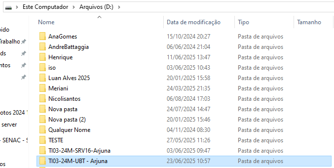

## Preparação da máquina virtual
### vamos usar a ferramenta de virtualização chamada Virtual Box


<a href="https://www.virtualbox.org/wiki/Downloads"> Faça o download aqui </a>


## Criando a máquina virtual

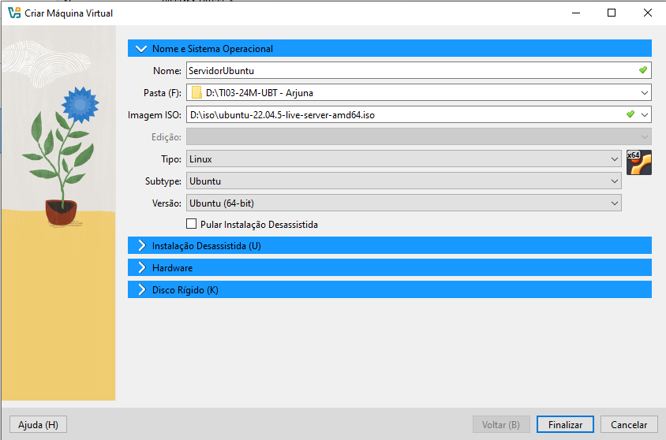


## Criando usuario e senha (será solicitado após a instalação do Ubuntu)

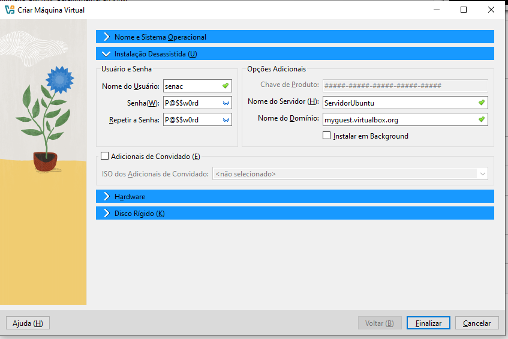

## Inserindo as configurações de Hardware para a instalação do Ubuntu

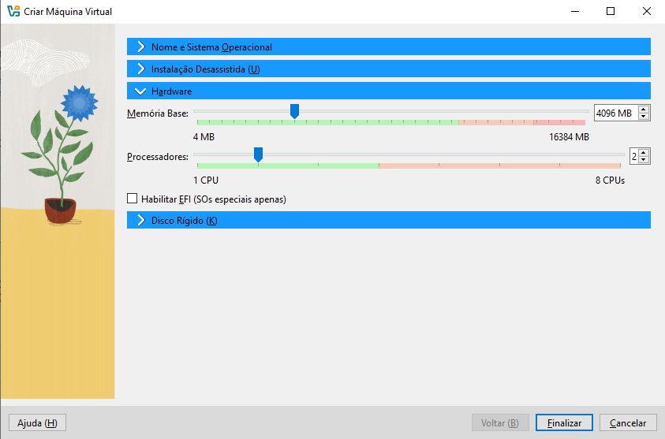

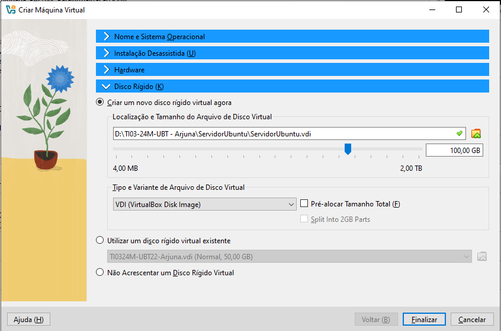

 Concluindo a configuração de hardware, clique em finalizar. 

# Instalando e configurando o Linux Ubuntu Server

 Após a instalação do Ubuntu, insira o usuario e a senha que criou na configuração da maquina virtualbox

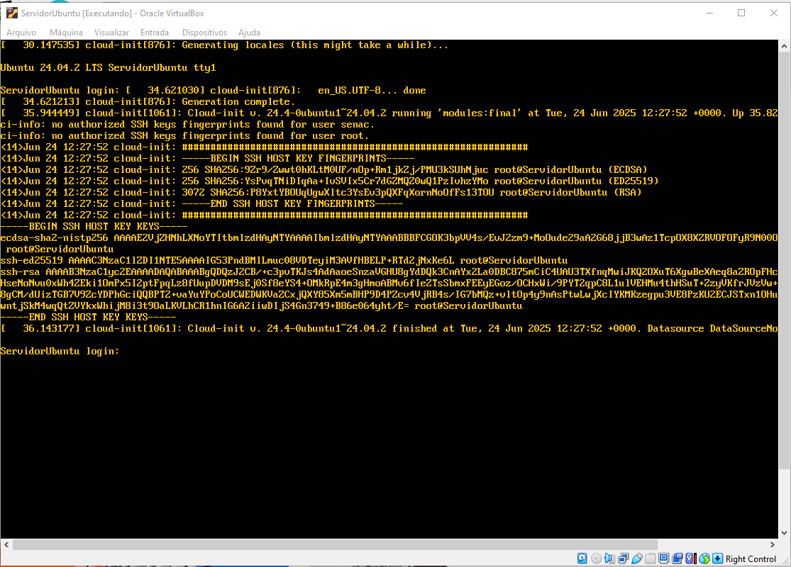
Observação: aperte enter para aparecer o usuario e senha.

## configuração e atualização dos comandos e app do ubuntu

Na tela informa as configurações de hardware utilizados pelo sistema operacional e a quantidade de updates a serem aplicados

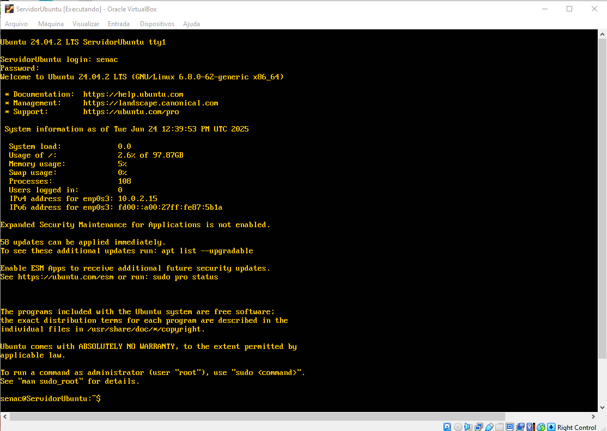

Para atualizar o sistema iremos usar os seguintes comandos:

```shell
sudo apt update -y
```
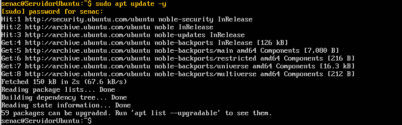

```shell
sudo apt upgrade -y 
```
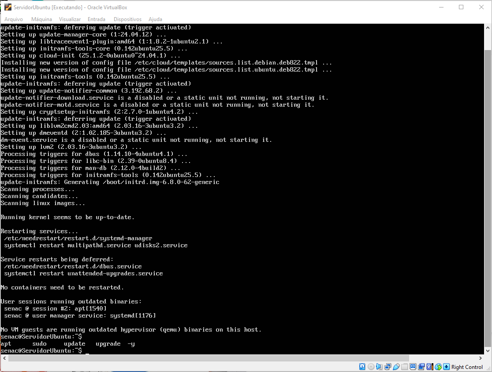

_reboot (irá reiniciar o ubuntu)

_instalar o cockpit - ferramenta para gerenciar o servidor, por meio de um ambiente gráfico online
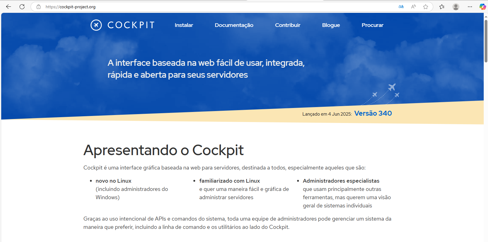


```shell
sudo apt install cockpit
```

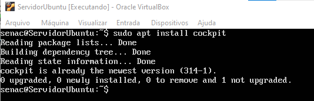


